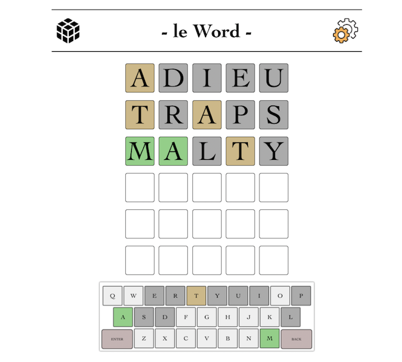

# le Word

A responsive clone of the popular guessing game, Wordle. A random 5-letter word is secretly chosen, and it is your job as the player to guess what that word is. For each guess, the game will check if the letters used are correct, correct but misplaced, or not in the word at all.

## Table of contents

- [Overview](#overview)
  - [The challenge](#the-challenge)
  - [Screenshot](#screenshot)
  - [Links](#links)
- [My process](#my-process)
  - [Built with](#built-with)
  - [What I learned](#what-i-learned)

## Overview

### The challenge

Users should be able to:

- Start a new game with a fresh board and keyboard
- Make guesses of words that ust be 5-letters long
- See which guesses were correctly placed, correctly chosen but incorrectly placed, or incorrectly chosen on the gameboard
- See which letters have already been guessed, guessed correctly, and guessed incorrect placement based on color on their virtual keyboard
- See the correct answer on game's end
- Restart the game on win/lose
- Switch between dark and light mode

### Screenshot



### Links

- Live Site URL: [le Word](https://jessejputnam.github.io/wordle-clone/)

## My process

### Built with

- Flexbox
- Mobile-first workflow
- JavaScript
- HTML

### What I learned

This project gave me some good insight into crestive problem solving. For example, I had an issue when trying to represent the player pressing ```backspace``` and how to ensure there was still a proper amount of white space. My solution was to use padEnd to fill the array with necessary whitespace:
```javascript
if (e.target.textContent === "BACK") {
        // Delete by creating white space to fill empty guessBoxes
        playerGuess = playerGuess.slice(0, -1).padEnd(5, " ");
        return;
      }
 ```
